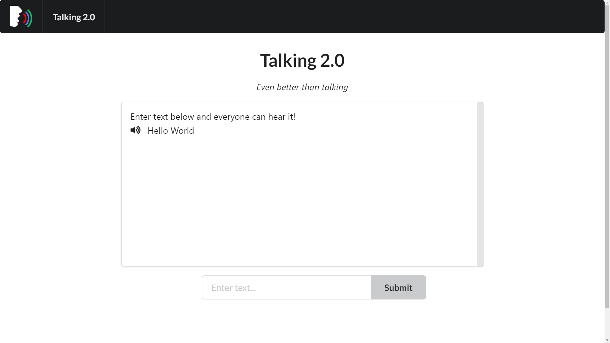

# Talking 2.0
### WarwickHACK 2019

Send data using sound!

The user sends a message, which is encoded in ASCII, over a custom serial protocol using frequency shift keying of ultrasonic sound. The morse code is played out loud, which the decoder can hear and turn back into ASCII, then text.

The interface is built in React using Semantics UI. The encoder and decoder use the webkit AudioContext interface.

# Team

- [Sporech](https://github.com/Sporech): Audio encoder
- [James Craster](https://github.com/JamesCraster): Interface with React and Semantics UI
- [Daniel Spencer](https://github.com/danielfspencer): Audio decoder
- [William Russell](https://github.com/wrussell1999): Getting everything to work with each other.

